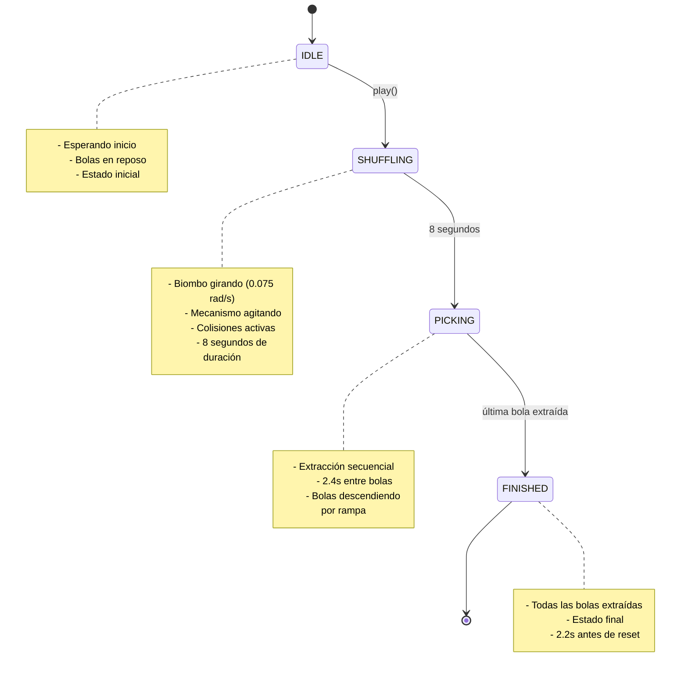

# 🎰 Biombo Engine Service - Documentación Técnica

## 📋 Descripción General

El **BiomboEngineService** es un servicio de Angular que implementa la lógica completa de una máquina de bingo/biombo virtual en 3D utilizando la biblioteca [Three.js](https://threejs.org/). Este servicio gestiona:

- Renderizado 3D de un biombo realista con cristal y mecanismos internos
- Simulación física de bolas de bingo con colisiones y dinámica realista
- Animación de agitación y extracción de bolas
- Sistema de iluminación cinematográfica
- Gestión del estado del juego (idle, shuffling, picking, finished)

---

## 🏗️ Arquitectura y Dependencias

### Dependencias Principales

```typescript
import { inject, Injectable, NgZone, signal } from '@angular/core';
import * as THREE from 'three';
import { RapierLoaderService } from '../../../core/services/rapier-loader.service';
```

- **Angular Core**: Inyección de dependencias, señales (signals) para reactividad
- **Three.js**: Renderizado 3D, geometría, materiales, iluminación
- **RapierLoaderService**: Motor físico para simulación de colisiones

### Patrones de Diseño

1. **Singleton Pattern** (`@Injectable()`): Una única instancia del servicio
2. **Signal-Based State Management**: Uso de Angular Signals para estado reactivo
3. **Observer Pattern**: Emisión de eventos de estado al componente

---

## 🎯 Propiedades Públicas (Signals)

### 1. `isReady` - Estado de Inicialización

```typescript
public readonly isReady = signal(false);
```

- **Tipo**: `Signal<boolean>`
- **Propósito**: Indica si el biombo está completamente cargado y listo para usar
- **Valor inicial**: `false`
- **Se establece en**: `true` después de `initialize()` exitoso

### 2. `errorMessage` - Mensajes de Error

```typescript
public readonly errorMessage = signal<string | null>(null);
```

- **Tipo**: `Signal<string | null>`
- **Propósito**: Captura errores durante la inicialización
- **Valor inicial**: `null`

### 3. `extractedBalls` - Bolas Extraídas

```typescript
public readonly extractedBalls = signal<number[]>([]);
```

- **Tipo**: `Signal<number[]>`
- **Propósito**: Mantiene el historial de bolas extraídas en orden
- **Uso**: Mostrar resultados del juego al usuario

### 4. `state` - Estado del Juego

```typescript
public readonly state = signal<BiomboState>('IDLE');
```

- **Tipo**: `Signal<BiomboState>`
- **Valores posibles**:
  - `'IDLE'`: Inactivo, esperando inicio
  - `'SHUFFLING'`: Agitando bolas (8 segundos)
  - `'PICKING'`: Extrayendo bolas individualmente
  - `'WAITING'`: Estado de espera (no usado actualmente)
  - `'FINISHED'`: Juego completado

---

## 🎬 Métodos Públicos

### 1. `initialize(container: HTMLElement, config: BiomboConfig): Promise<void>`

Inicializa todo el entorno 3D del biombo.

#### Parámetros

| Parámetro | Tipo | Descripción |
|-----------|------|-------------|
| `container` | `HTMLElement` | Elemento DOM donde renderizar el canvas WebGL |
| `config` | `BiomboConfig` | Configuración del biombo (cantidad de bolas, tipo, etc.) |

#### Proceso de Inicialización

1. **Carga del motor físico Rapier**
2. **Configuración de escena 3D**:
   - Creación de `THREE.Scene` con fondo de skybox
   - Configuración de cámara `THREE.PerspectiveCamera`
   - Creación de `THREE.WebGLRenderer` con antialiasing

3. **Configuración de iluminación**:
   - `AmbientLight`: Iluminación ambiental suave (0.65 intensidad)
   - `DirectionalLight`: Luz principal con sombras (1.9 intensidad)
   - `PointLight` × 2: Luces de borde para efecto rim lighting

4. **Carga de modelos 3D**:
   - `hollow_sphere.fbx`: Esfera hueca de cristal (el biombo)
   - `ornaments.fbx`: Ornamentos y soporte del biombo
   - `ramp.fbx`: Rampas inferiores para bolas extraídas

5. **Construcción de mecanismos internos**:
   - Eje de rotación principal
   - Sistema de tuberías internas
   - Trípode de soporte
   - 24 bolas de agitación

6. **Arranque del loop de animación**

#### Materiales Utilizados

```typescript
// Cristal del biombo
const glassMaterial = new THREE.MeshPhysicalMaterial({
  color: 0xffffff,
  metalness: 0.05,
  roughness: 0.04,
  transmission: 0.94,      // Translucidez
  thickness: 1.0,
  transparent: true,
  opacity: 0.45,
  clearcoat: 1.0,          // Acabado pulido
});

// Chasis oscuro
const darkChassisMaterial = new THREE.MeshStandardMaterial({
  color: 0x15181f,
  metalness: 0.85,
  roughness: 0.35,
});

// Bolas de bingo
const ballMaterial = new THREE.MeshStandardMaterial({
  color: this.agitationPalette[index % this.agitationPalette.length],
  roughness: 0.18,        // Muy pulido
  metalness: 0.08,        // Poco metálico
});
```

---

### 2. `play(): void`

Inicia la secuencia de juego completa.

#### Flujo de Ejecución

```typescript
this.state.set('SHUFFLING');                    // Estado agitación
const drawSequence = generateBiomboResults(this.config);

// 1. Fase de agitación (8 segundos)
window.setTimeout(() => {
  this.state.set('PICKING');                    // Estado extracción
  
  // 2. Extraer bolas una por una
  drawSequence.forEach((ballNumber, index) => {
    window.setTimeout(() => {
      this.spawnBallExitThroughBottom(ballNumber, index);
      
      if (index === drawSequence.length - 1) {
        window.setTimeout(() => this.state.set('FINISHED'), 2200);
      }
    }, index * 2400);                           // 2.4s entre bolas
  });
}, this.shuffleDurationMs);                      // 8000ms = 8 segundos
```

#### Temporizadores

- **Shuffle duration**: `8000ms` (8 segundos de agitación)
- **Entre bolas**: `2400ms` (2.4 segundos para ver el descenso completo)
- **Finalización**: `2200ms` después de la última bola

---

### 3. `resize(width: number, height: number): void`

Ajusta el tamaño del renderer cuando cambia el tamaño del contenedor.

```typescript
public resize(width: number, height: number): void {
  if (this.renderer && this.camera && height > 0) {
    this.camera.aspect = width / height;
    this.camera.updateProjectionMatrix();
    this.renderer.setSize(width, height);
  }
}
```

---

### 4. `destroy(): void`

Limpia todos los recursos y libera memoria.

```typescript
public destroy(): void {
  this.clearTimers();
  this.clearBallEffects();
  if (this.animFrameId) cancelAnimationFrame(this.animFrameId);
  this.renderer?.dispose();
}
```

---

## ⚙️ Métodos Privados (Implementación Interna)

### 1. `arrangeBallsNaturally(): void`

Calcula posiciones naturales para las bolas dentro del biombo usando un algoritmo de empaquetamiento esferical.

#### Algoritmo de Empaquetamiento

```typescript
// Cálculo de altura del centro del "bowl" (parte inferior de la esfera)
let bowlCenterY = -8.5;
if (this.solids['hollow']?.mesh) {
  const box = new THREE.Box3().setFromObject(this.solids['hollow'].mesh);
  bowlCenterY = box.min.y + ballRadius + 0.45;
}

// Distribución en capas concéntricas
const bowlCurvature = 0.052;
let currentLayer = 0;
let ballsInCurrentLayer = 0;
let maxInLayer = 1;

for (let i = 0; i < totalBalls; i++) {
  if (ballsInCurrentLayer >= maxInLayer) {
    currentLayer++;
    ballsInCurrentLayer = 0;
    maxInLayer = Math.min(6 * currentLayer, 18);  // Límite por capa
  }

  // Posición en espiral
  const angle = (ballsInCurrentLayer / maxInLayer) * Math.PI * 2 + (currentLayer * 0.55);
  const radiusDist = currentLayer * (minDist * 0.9);
  const x = Math.cos(angle) * radiusDist;
  const z = Math.sin(angle) * radiusDist;
  const y = bowlCenterY + (radiusDist * radiusDist * bowlCurvature) + (currentLayer * 0.32);
}

// Iteración de relajamiento (similare a simulated annealing)
for (let iter = 0; iter < 25; iter++) {
  // Separación mínima entre bolas
  for (let i = 0; i < positions.length; i++) {
    for (let j = i + 1; j < positions.length; j++) {
      const delta = new THREE.Vector3().subVectors(positions[i], positions[j]);
      const dist = delta.length();

      if (dist < minDist && dist > 0.0001) {
        // Separar bolas superpuestas
        const overlap = (minDist - dist) * 0.5;
        delta.normalize().multiplyScalar(overlap);
        positions[i].add(delta);
        positions[j].sub(delta);
      }
    }
    
    // Aplicar curvatura del bowl
    const distFromCenter = Math.sqrt(positions[i].x ** 2 + positions[i].z ** 2);
    const floorY = bowlCenterY + (distFromCenter * distFromCenter * bowlCurvature);
    if (positions[i].y < floorY) {
      positions[i].y = floorY;
    }
  }
}
```

---

### 2. `buildDrumPivot(hollow: SolidEntity): void`

Crea el pivote de rotación para la esfera hueca del biombo.

#### Componentes Construidos

```typescript
const pivot = new THREE.Group();
pivot.name = 'sphere-rotation-pivot';

const sphereAssembly = new THREE.Group();
sphereAssembly.name = 'rotating-sphere-assembly';

// Se adjuntan todas las mallas de la esfera al pivote
hollow.meshes.forEach((mesh) => {
  mesh.updateMatrixWorld(true);
  bounds.expandByObject(mesh);
});
```

---

### 3. `buildMainRotationShaft(): void`

Construye el eje principal de rotación del biombo.

#### Geometría del Eje

```typescript
// Eje central (15.4 unidades de largo)
const shaft = new THREE.Mesh(
  new THREE.CylinderGeometry(0.28, 0.28, 15.4, 24),
  shaftMaterial
);
shaft.rotation.z = Math.PI / 2;

// Collares en ambos extremos
for (const position of [-5.9, 5.9]) {
  const collar = new THREE.Mesh(
    new THREE.CylinderGeometry(0.48, 0.48, 0.42, 24),
    edgeMaterial
  );
  collar.position.x = position;
}

// Cojinetes en las bases
for (const position of [-6.25, 6.25]) {
  const bearing = new THREE.Mesh(
    new THREE.CylinderGeometry(0.78, 0.78, 0.8, 24),
    bearingMaterial
  );
  // ... montaje del cojinete
}
```

---

### 4. `buildInternalMechanism(): void`

Construye el mecanismo interno que agita las bolas.

#### Componentes del Mecanismo

```typescript
const mechanism = new THREE.Group();

// Hub central
const hub = new THREE.Mesh(
  new THREE.CylinderGeometry(0.48, 0.48, 1.3, 24),
  tubeMaterial
);

// Tapón del hub
const hubCap = new THREE.Mesh(
  new THREE.SphereGeometry(0.62, 20, 20),
  tubeMaterial
);

// 3 tuberías radiales (120° entre sí)
for (let index = 0; index < 3; index++) {
  const tube = new THREE.Mesh(
    new THREE.CylinderGeometry(0.13, 0.13, 6.6, 14),
    tubeMaterial
  );
  tube.rotation.y = (index * Math.PI) / 3;
}

// Tubo circular exterior
const circularTube = new THREE.Mesh(
  new THREE.TorusGeometry(3.45, 0.1, 12, 72),
  tubeMaterial
);
```

---

### 5. `buildAgitationBalls(): void`

Crea las 24 bolas de agitación con colores alternados.

#### Paleta de Colores

```typescript
const agitationPalette = [
  0x00d2ff, // Azul cian
  0xffd200, // Amarillo brillante
  0xff3b6f, // Rosa magenta (bola 10)
  0x00e676, // Verde lima
  0xffffff, // Blanco perla
  0x9c27b0, // Púrpura
  0xff9100, // Naranja
  0x3d5afe, // Azul cobalto
];

// Creación de bolas
for (let index = 0; index < total; index++) {
  const ballGeometry = new THREE.SphereGeometry(0.92, 24, 24);
  
  const ballMaterial = new THREE.MeshStandardMaterial({
    color: this.agitationPalette[index % this.agitationPalette.length],
    roughness: 0.18,        // Acabado esmaltado brillante
    metalness: 0.08,        // Poco metálico
  });
  
  const ball = new THREE.Mesh(ballGeometry, ballMaterial);
  ball.renderOrder = 3;
}
```

---

### 6. `animate(): void`

Loop principal de animación que gestiona toda la física y renderizado.

#### Ciclo de Animación

```typescript
this.animFrameId = requestAnimationFrame(() => this.animate());
const now = performance.now();
const deltaSeconds = this.lastAgitationFrame === 0
  ? 1 / 60
  : Math.min((now - this.lastAgitationFrame) / 1000, 1 / 30);
this.lastAgitationFrame = now;
```

#### Rotación del Biombo

```typescript
// Velocidad de rotación durante agitación
const shaftSpeed = isAgitating ? 0.075 : 0;
this.mainRotationAngle += shaftSpeed;

if (this.mainRotationShaftGroup) {
  this.mainRotationShaftGroup.rotation.set(this.mainRotationAngle, 0, 0);
}

if (this.drumGroup) {
  this.drumGroup.rotation.set(this.mainRotationAngle, 0, 0);
}
```

#### Mecanismo Interno con Movimiento Oscilatorio

```typescript
if (this.mechanismGroup) {
  // Movimiento armónico simple para agitación
  this.mechanismBias += isAgitating ? 0.03 : 0.005;
  
  const agitationBoost = isAgitating ? 1 : 0.12;
  
  // Rotación Y con componente sinusoidal
  this.mechanismGroup.rotation.y += 
    (0.035 + Math.sin(this.mechanismBias * 1.8) * 0.02) * agitationBoost;
  
  // Rotación X oscilatoria
  this.mechanismGroup.rotation.x = 
    (Math.sin(this.mechanismBias * 2.4) * 0.6) * agitationBoost;
  
  // Rotación Z oscilatoria
  this.mechanismGroup.rotation.z = 
    (Math.cos(this.mechanismBias * 2.9) * 0.35) * agitationBoost;
}
```

---

### 7. Dinámica Física de Bolas (⚙️ DINÁMICA FÍSICA BALÍSTICA DE IMPACTO REAL)

#### Sistema de Gravedad en Sistema de Referencia Rotatorio

```typescript
if (this.agitationBallStates.length > 0 && this.state() !== 'IDLE') {
  const sphereRadius = 9.8;
  const drumQuaternion = new THREE.Quaternion();
  if (this.ballGroup) {
    this.ballGroup.getWorldQuaternion(drumQuaternion);
  }

  // Calcular dirección de gravedad en sistema local del biombo
  const worldGravityDir = new THREE.Vector3(0, -1, 0);
  const localGravityDir = worldGravityDir.clone()
    .applyQuaternion(drumQuaternion.clone().invert());
}
```

#### FASE 1: Impulso Balístico (Agitación)

```typescript
if (isAgitating) {
  const localYPosition = ball.position.dot(localGravityDir.clone().negate());

  // 1. Impulso hacia arriba desde el fondo del biombo
  if (localYPosition < -5.8) {
    const kickUp = Math.random() * 55.0 + 40.0;
    velocity.addScaledVector(localGravityDir.clone().negate(), 
      kickUp * deltaSeconds * 2.8);

    // Impulso horizontal aleatorio
    const kickX = (Math.random() - 0.5) * 45.0;
    const kickZ = (Math.random() - 0.5) * 45.0;
    velocity.x += kickX * deltaSeconds * 2.2;
    velocity.z += kickZ * deltaSeconds * 2.2;
  }

  // Aplicar gravedad
  velocity.addScaledVector(localGravityDir, 68.0 * deltaSeconds);

  // Fricción del aire (resistencia)
  velocity.x *= Math.pow(0.992, deltaSeconds * 60);
  velocity.z *= Math.pow(0.992, deltaSeconds * 60);
  velocity.y *= Math.pow(0.995, deltaSeconds * 60);
}
```

#### FASE 2: Asentamiento (Fin del Giro / Picking)

```typescript
else {
  // ⭐ 2. FASE DE ASENTAMIENTO (FIN DEL GIRO / PICKING):
  const localYPosition = ball.position.dot(localGravityDir.clone().negate());

  // Gravedad fuerte: caen de golpe hacia el piso de vidrio
  velocity.addScaledVector(localGravityDir, 110.0 * deltaSeconds);

  // Fricción suave mientras caen
  velocity.x *= Math.pow(0.96, deltaSeconds * 60);
  velocity.z *= Math.pow(0.96, deltaSeconds * 60);
  velocity.y *= Math.pow(0.97, deltaSeconds * 60);

  // ⭐ Freno y reposo absoluto ÚNICAMENTE cuando llegaron al fondo (Y < -6.0)
  if (localYPosition < -6.0) {
    velocity.multiplyScalar(Math.pow(0.65, deltaSeconds * 60));

    // Si ya están asentadas, congelar a 0
    if (velocity.lengthSq() < 0.25) {
      velocity.set(0, 0, 0);
    }
  }
}
```

#### FASE 3: Colisión con el Cristal

```typescript
// ⭐ 3. COLISIÓN CON EL CRISTAL SIN MICRO-REBOTES
const currentDistance = ball.position.length();
const maxAllowedDistance = sphereRadius - ballState.radius;

if (currentDistance > maxAllowedDistance) {
  const normal = ball.position.clone().normalize();
  ball.position.copy(normal.clone().multiplyScalar(maxAllowedDistance));
  const dot = velocity.dot(normal);

  if (dot > 0) {
    if (isAgitating) {
      // Rebote vivo durante el sorteo
      const bounce = 1.65;  // Coeficiente de restitución > 1 (energía añadida)
      velocity.sub(normal.multiplyScalar(bounce * dot));
      velocity.x += (Math.random() - 0.5) * 8.0;
      velocity.z += (Math.random() - 0.5) * 8.0;
    } else {
      // En reposo: absorción total del impacto
      velocity.sub(normal.multiplyScalar(dot));
      velocity.multiplyScalar(0.6);
    }
  }
}
```

#### FASE 4: Choques Inter-Bolas (Intercambio de Energía)

```typescript
// ⭐ 5. CHOQUES INTER-PELOTAS (Intercambio de energía para dispersión)
const balls = this.agitationBallStates;
for (let i = 0; i < balls.length; i++) {
  for (let j = i + 1; j < balls.length; j++) {
    const delta = new THREE.Vector3().subVectors(
      balls[j].mesh.position, 
      balls[i].mesh.position
    );
    const distance = delta.length();
    const minDistance = balls[i].radius + balls[j].radius;

    if (distance < minDistance && distance > 0.0001) {
      const normal = delta.clone().normalize();
      const overlap = minDistance - distance;
      const correction = normal.clone().multiplyScalar(overlap * 0.5);

      // Separar bolas superpuestas
      balls[i].mesh.position.sub(correction);
      balls[j].mesh.position.add(correction);

      if (isAgitating) {
        // Conservación de momento lineal en colisión elástica
        const relativeVelocity = new THREE.Vector3()
          .subVectors(balls[i].velocity, balls[j].velocity);
        const speedAlongNormal = relativeVelocity.dot(normal);

        if (speedAlongNormal > 0) {
          const impulse = normal.clone().multiplyScalar(speedAlongNormal * 0.75);
          balls[i].velocity.sub(impulse);
          balls[j].velocity.add(impulse);
        }
      }
    }
  }
}
```

---

### 8. `spawnBallExitThroughBottom(ballNumber: number, index: number): void`

Crea la animación de una bola saliendo por el fondo hacia la rampa.

#### Curva Catmull-Rom para Trayectoria Realista

```typescript
const trackFloorY = -10.95;
const trackZ = 2.45;

const endOfTrackX = 19; // Posición de tope final
const ballSpacing = 2.15; // Distancia entre centros de bolas

const targetSlotX = endOfTrackX - (index * ballSpacing);
const targetSlotPos = new THREE.Vector3(targetSlotX, trackFloorY, trackZ);

// Puntos de control para curva Catmull-Rom
const pStart = new THREE.Vector3(0, -8.2, 0.2);      // Punto inicial
const pDrop = new THREE.Vector3(0.1, -9.5, 0.9);     // Curva inicial
const pRampEntry = new THREE.Vector3(0.4, -10.5, 1.8); // Entrada a rampa
const pRampMid = new THREE.Vector3(
  Math.max(0.6, targetSlotX * 0.5), 
  -10.85, 2.2
); // Punto medio en rampa

const curve = new THREE.CatmullRomCurve3([
  pStart,
  pDrop,
  pRampEntry,
  pRampMid,
  targetSlotPos,
]);

// Crear bola con número impreso
const ballGeometry = new THREE.SphereGeometry(0.95, 32, 32);
const numberTexture = this.createBallNumberTexture(ballNumber);
const material = new THREE.MeshStandardMaterial({
  map: numberTexture,
  roughness: 0.15,
  metalness: 0.1,
});

const mesh = new THREE.Mesh(ballGeometry, material);
mesh.castShadow = true;
mesh.receiveShadow = true;

this.ballEffects.push({
  mesh,
  startAt: performance.now(),
  duration: 1.85,
  curve,
  targetSlotPos,
  ballNumber,
  hasSettled: false,
});
```

---

### 9. `createBallNumberTexture(value: number): THREE.CanvasTexture`

Genera una textura con el número de la bola impreso.

#### Proceso de Creación de Textura

```typescript
const canvas = document.createElement('canvas');
canvas.width = 256;
canvas.height = 256;
const ctx = canvas.getContext('2d');

// Determinar color base según tipo de bola
const isYellow = this.config?.ballType === 'yellow';
const baseColor = isYellow 
  ? '#ffd200' 
  : this.agitationPalette[(value - 1) % this.agitationPalette.length];

// Fondo brillante esmaltado
ctx.fillStyle = typeof baseColor === 'number' 
  ? `#${baseColor.toString(16).padStart(6, '0')}` 
  : baseColor;
ctx.fillRect(0, 0, 256, 256);

// Círculo blanco central (característico de bolas de bingo)
ctx.fillStyle = '#ffffff';
ctx.beginPath();
ctx.arc(128, 128, 80, 0, Math.PI * 2);
ctx.fill();

// Número impreso nítido
ctx.fillStyle = '#0f1115';
ctx.font = 'bold 90px Arial, sans-serif';
ctx.textAlign = 'center';
ctx.textBaseline = 'middle';
ctx.fillText(String(value), 128, 134);

// Subrayado para el 6 y 9 (para evitar confusión)
if (value === 6 || value === 9 || 
    value === 66 || value === 99 || 
    value === 69 || value === 96) {
  ctx.fillRect(100, 185, 56, 8);
}

const texture = new THREE.CanvasTexture(canvas);
texture.needsUpdate = true;
return texture;
```

---

### 10. `clearBallEffects(): void`

Limpia todas las animaciones de bolas y restaura visibilidad de bolas internas.

```typescript
for (const animation of this.ballEffects) {
  this.scene?.remove(animation.mesh);
  animation.mesh.geometry?.dispose();
  if (Array.isArray(animation.mesh.material)) {
    animation.mesh.material.forEach((mat) => mat.dispose());
  } else {
    animation.mesh.material?.dispose();
  }
}
this.ballEffects = [];

// Restaurar visibilidad de bolas internas para nueva ronda
this.agitationBalls.forEach((b) => (b.visible = true));
```

---

## 📊 Estructura de Datos

### AgitationBallState

```typescript
type AgitationBallState = {
  mesh: THREE.Mesh;              // Referencia a la malla de la bola
  velocity: THREE.Vector3;       // Vector de velocidad actual
  phase: number;                 // Fase para animación oscilatoria
  radius: number;                // Radio de la bola (0.92)
};
```

### BallExitAnimation

```typescript
type BallExitAnimation = {
  mesh: THREE.Mesh;              // Bola en animación
  startAt: number;               // Tiempo de inicio (performance.now())
  duration: number;              // Duración total (1.85s)
  curve: THREE.CatmullRomCurve3; // Trayectoria de la bola
  targetSlotPos: THREE.Vector3;  // Posición final en rampa
  ballNumber: number;            // Número de la bola
  hasSettled: boolean;           // Si ha completado la animación
  startRotZ?: number;            // Rotación Z inicial (para frenado)
  startRotY?: number;            // Rotación Y inicial
  startRotX?: number;            // Rotación X inicial
  targetRotZ?: number;           // Rotación Z objetivo
};
```

---

## 🔧 Configuración de Materiales

### Cristal del Biombo (MeshPhysicalMaterial)

```typescript
const glassMaterial = new THREE.MeshPhysicalMaterial({
  color: 0xffffff,              // Color base blanco
  metalness: 0.05,              // Muy poco metálico
  roughness: 0.04,              // Superficie muy lisa
  transmission: 0.94,           // Alta transparencia (vidrio)
  thickness: 1.0,               // Grosor del material (para refracción)
  transparent: true,            // Translúcido
  opacity: 0.45,                // Opacidad del vidrio
  depthWrite: false,            // No escribir en depth buffer (evitar artefactos)
  side: THREE.DoubleSide,       // Renderizar ambos lados
  reflectivity: 0.9,            // Alta reflectividad
  clearcoat: 1.0,               // Capa protectora brillante
  clearcoatRoughness: 0.05,     // Muy lisa (como vidrio pulido)
});
```

### Iluminación del Escena

```typescript
// Luz ambiental suave
const ambientLight = new THREE.AmbientLight(0xffffff, 0.65);

// Luz principal con sombras
const mainLight = new THREE.DirectionalLight(0xffffff, 1.9);
mainLight.position.set(15, 30, 25);
mainLight.castShadow = true;

// Luces de borde (rim lighting) para definición
const rimLightLeft = new THREE.PointLight(0x70a0ff, 18, 80);
const rimLightRight = new THREE.PointLight(0xffffff, 12, 80);
```

---

## 🎮 Estados del Juego

### Diagrama de Estado



---

## 📈 Rendimiento y Optimizaciones

### Técnicas de Optimización Implementadas

1. **Reutilización de geometrías**: Las bolas usan la misma geometría de esfera
2. **Instanciación de materiales**: Paleta de colores reutilizada
3. **Culling automático**: Three.js oculta objetos fuera del campo de visión
4. **DepthWrite deshabilitado**: Para el cristal, evita artefactos de profundidad
5. **Delta time**: Uso de `deltaSeconds` para animación independiente del framerate

### Gestión de Memoria

```typescript
// En destroy() y clearBallEffects()
animation.mesh.geometry?.dispose();
animation.mesh.material?.dispose();
this.renderer?.dispose();
cancelAnimationFrame(this.animFrameId);
```

---

## 🔍 Debugging y Herramientas

### Inspección de Objetos 3D

Para inspeccionar objetos en la escena durante el desarrollo:

```typescript
// Añadir inspector de escena
import { OrbitControls } from 'three/addons/controls/OrbitControls.js';

const controls = new OrbitControls(camera, renderer.domElement);
controls.enableDamping = true;
```

### Logging de Estado

```typescript
console.log('Estado del biombo:', this.state());
console.log('Bolas extraídas:', this.extractedBalls());
console.log('Error:', this.errorMessage());
```

---

## 📝 Ejemplo de Uso

```typescript
// Inicialización
const biomboEngine = inject(BiomboEngineService);
const container = document.getElementById('biombo-container');

const config: BiomboConfig = {
  id: 'biombo-1',
  title: 'Biombo Principal',
  ballAmount: 90,
  resultCount: 15,
  ballType: 'color',
};

await biomboEngine.initialize(container, config);

// Verificar si está listo
if (biomboEngine.isReady()) {
  // Iniciar juego
  biomboEngine.play();
  
  // Suscribirse a cambios de estado
  biomboEngine.state.subscribe(state => {
    console.log('Nuevo estado:', state);
    // Actualizar UI según estado
  });
}

// Manejar redimensionamiento
window.addEventListener('resize', () => {
  const width = container.clientWidth;
  const height = container.clientHeight;
  biomboEngine.resize(width, height);
});

// Limpieza
biomboEngine.destroy();
```

---

## 📚 Referencias Externas

- [Three.js Documentation](https://threejs.org/docs/)
- [Angular Signals](https://angular.dev/guide/signals)
- [Rapier Physics](https://rapier.rs/docs/)
- [Catmull-Rom Spline](https://en.wikipedia.org/wiki/Catmull%E2%80%93Rom_spline)

---

## 📋 Resumen de Constantes

| Constante | Valor | Descripción |
|-----------|-------|-------------|
| `shuffleDurationMs` | 8000 | Duración de agitación (8s) |
| `ballSpacing` | 2.15 | Distancia entre bolas en rampa |
| `endOfTrackX` | 19 | Posición final en rampa |
| `trackFloorY` | -10.95 | Altura del suelo de la rampa |
| `sphereRadius` | 9.8 | Radio de la esfera hueca |
| `minDist` | ballRadius × 2.05 | Distancia mínima entre bolas |
| `bowlCurvature` | 0.052 | Curvatura del bowl interior |
| `shakeDurationMs` | 8000 | Duración de agitación |

---

## 🎨 Paleta de Colores de Bolas

```typescript
const agitationPalette = [
  0x00d2ff, // Azul cian (#00d2ff)
  0xffd200, // Amarillo brillante (#ffd200)
  0xff3b6f, // Rosa magenta (#ff3b6f)
  0x00e676, // Verde lima (#00e676)
  0xffffff, // Blanco perla (#ffffff)
  0x9c27b0, // Púrpura (#9c27b0)
  0xff9100, // Naranja (#ff9100)
  0x3d5afe, // Azul cobalto (#3d5afe)
];
```

---

## ✅ Checklist de Implementación

- [x] Inicialización de escena 3D
- [x] Carga de modelos FBX
- [x] Configuración de iluminación
- [x] Construcción de mecanismo interno
- [x] Creación de 24 bolas de agitación
- [x] Algoritmo de empaquetamiento esferical
- [x] Loop de animación con física
- [x] Sistema de colisiones inter-bolas
- [x] Extracción secuencial de bolas
- [x] Animación de descenso por rampa
- [x] Generación de texturas de números
- [x] Manejo de redimensionamiento
- [x] Limpieza de recursos

---

## 📞 Soporte y Contacto

Para reportar bugs o solicitar características:
- Issue tracker del proyecto
- Reuniones de revisión de código
- Documentación de API en `/Docs/`

---

**Última actualización**: 2026-10-05  
**Versión del documento**: 1.0  
**Autor**: Equipo de Desarrollo Biombo Arena
